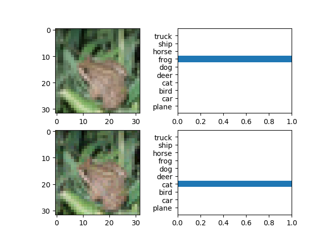
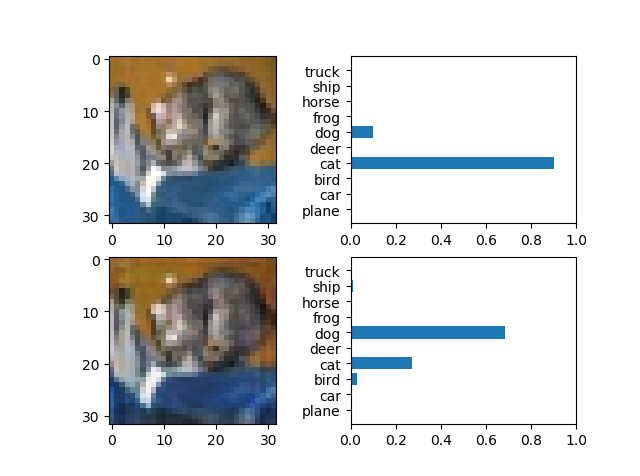
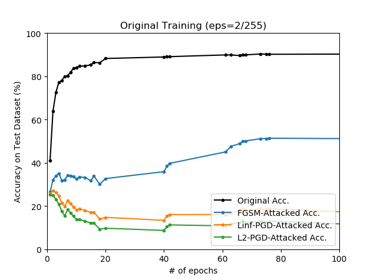
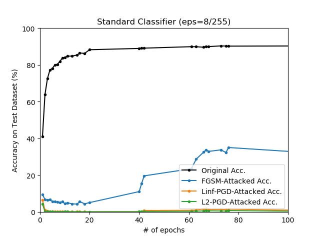
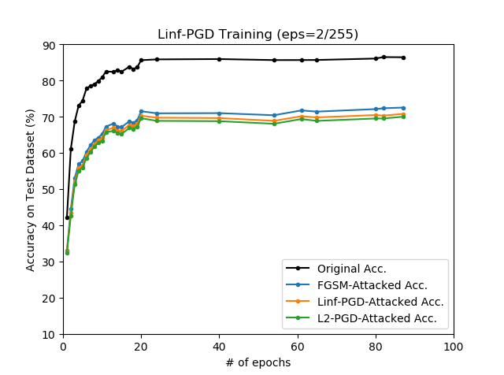
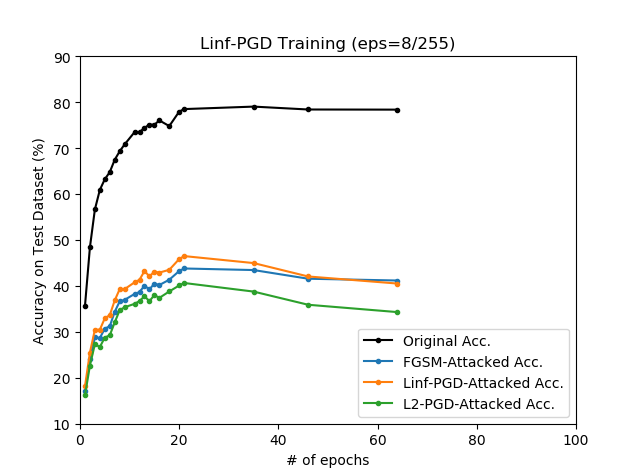
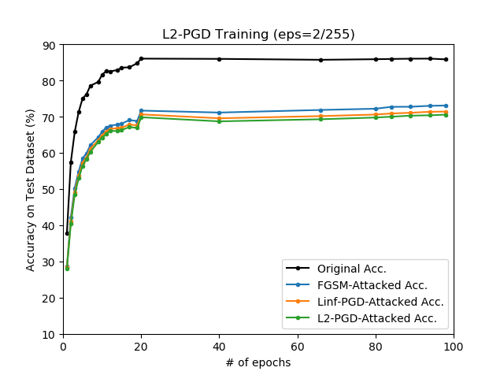
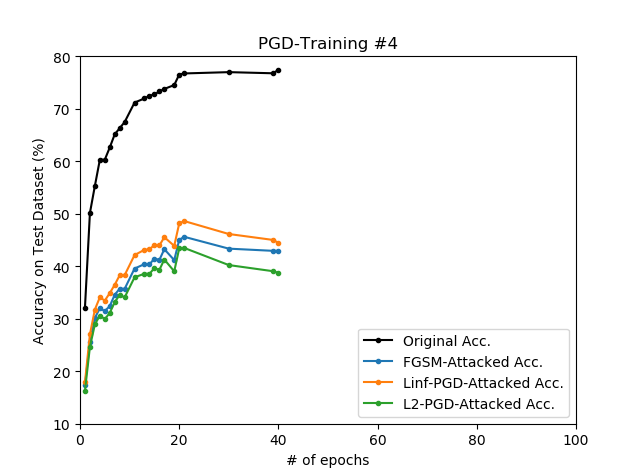

# Adversarial Training with ATN (CIFAR-10)

## Overview

Adversasrial examples can be generated via neural networks, and these special networks are called Adversarial Transformation Network. This repository verifies that ATN can be useful for adversarial training. The references are as follows:

* **Adversarial Transformation Networks: Learning to Generate Adversarial Examples** <br>
  *Shumeeet Baluja, Ian Fischer* <br>
  https://arxiv.org/abs/1703.09387

* **Towards Deep Learning Models Resistant to Adversarial Attacks** <br>
  *Aleksander Madry, Aleksandar Makelov, Ludwig Schmidt, Dimitris Tsipras, Adrian Vladu* <br>
  https://arxiv.org/abs/1706.06083

## Notes on ATN

### Types of ATN

Intuitively, we can think of two main types of ATN. Only AAE-ATN will be studied in this repository.

* **Perturbation ATN (P-ATN)** <br>
  It is the type of ATN that generates small, but effective perturbations that acts as a filter on the image. The image combined with the generated perturbations acts as adversarial exmaple for the target classifier.

* **Adversarial Auto-Encoding ATN (AAE-ATN)** <br>
  AAE-ATNs are similar to standard autoencoders in that they attempt to accurately reconstruct the original image. However, there is a difference in that the reconstructed image acts as adversarial example for the target classifier.

### Defining Loss for ATN

In general, ATN can be trained with weighted sum of two losses:

1. **Lx: Perturbation Loss** <br>
   The adversarial example generated by ATN should not be distinguishable by the human eye. It is generally known that simply using L2 Loss is sufficient.

2. **Ly: Adversarial Loss** <br>
   The adversarial example generated by ATN should cause target classifiers to malfunction. It should be properly defined according to the type of attack (non-targeted or targeted).

However, it is difficult to create an ATN that produces adversarial examples that satisfy Lx and Ly at the same time. Intuitively, reducing Lx increases Ly, and reducing Ly increases Lx, and it makes difficulty to define the entire loss function properly.

## Demo: Adversarial Attack

<p align="center">
    
</p>

```
python demo_pgd.py --device cpu
                   --pgd_type linf

python demo_atn.py --device cpu
```

The PGD on left side works by calculating the gradients for a given classification network (we assume a white-box in this situation), and it can almost always produce valid results for typical images without pre-requirements. However, in the case of ATN on right side, note that it is only possible to produce valid results after a proper learning has been achieved (this is not satisfactory in this demonstration, and the cat image is just a specially easy case).

## Result: Adversarial Training

### Standard Training

<p align="center">
    
</p>

### PGD-Training

#### Linf-PGD

<p align="center">
    
</p>

#### L2-PGD

<p align="center">
    
</p>

### ATN-Training
