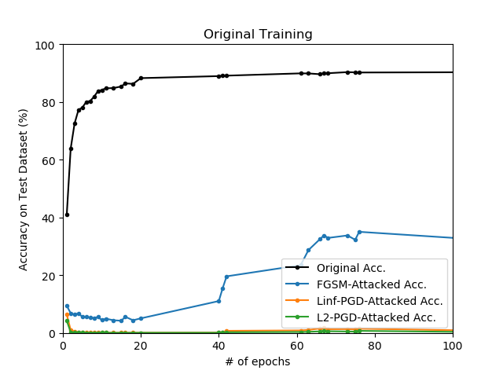
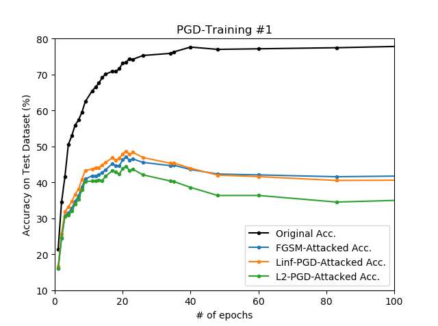
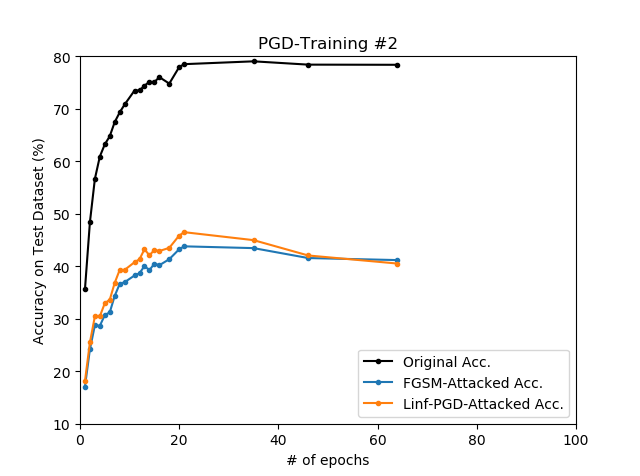
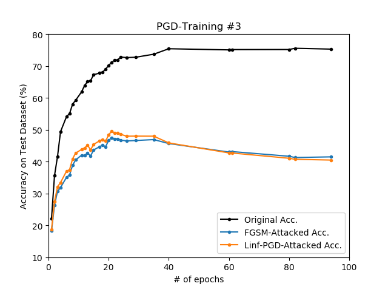
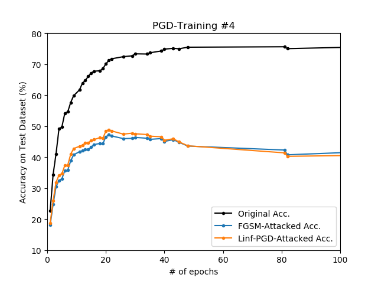

## Adversarial Training (CIFAR-10)

### Original Classifier

<p align="center">
    
</p>

```
python train.py --device cuda
                --epochs 200
                --batch_size 32
                --lr 0.01
                --lr_decay 20

* data augmentation: RandomHorizontalFlip
```

| epoch | Original Acc. | FGSM-Attacked Acc. | Linf-PGD-Attacked Acc. | L2-PGD Attacked Acc. |
| :-:   |  -:           |  -:                |  -:                    | -:                   |
| e076  | 90.19 %       | 34.99 %            | 01.43 %                | 00.67 %              |

### PGD-Trained Classifier

#### PGD-Training #1 (Linf, true label)

<p align="center">
    
</p>

```
python train.py --device cuda
                --epochs 200
                --batch_size 32
                --lr 0.01
                --lr_decay 20
                --pgd_train linf
                --pgd_epsilon 8
                --pgd_label 0

* data augmentation: RandomHorizontalFlip
```

| epoch | Original Acc. | FGSM-Attacked Acc. | Linf-PGD-Attacked Acc. | L2-PGD Attacked Acc. |
| :-:   |  -:           |  -:                |  -:                    | -:                   |
| e022  | 74.39 %       | 46.18 %            | 47.76 %                | 43.32 %              |
| e040  | 77.62 %       | 43.55 %            | 43.91 %                | 38.57 %              |

#### PGD-Training #2 (Linf, predicted label)

<p align="center">
    
</p>

```
python train.py --device cuda
                --epochs 200
                --batch_size 32
                --lr 0.01
                --lr_decay 20
                --pgd_train linf
                --pgd_epsilon 8
                --pgd_label 1

* data augmentation: RandomHorizontalFlip
```

| epoch | Original Acc. | FGSM-Attacked Acc. | Linf-PGD-Attacked Acc. | L2-PGD Attacked Acc. |
| :-:   |  -:           |  -:                |  -:                    | -:                   |
| e021  | 78.49 %       | 43.77 %            | 46.47 %                | 40.61 %              |

#### PGD-Training #3 (L2, true label)

<p align="center">
    
</p>

```
python train.py --device cuda
                --epochs 200
                --batch_size 32
                --lr 0.01
                --lr_decay 20
                --pgd_train l2
                --pgd_epsilon 8
                --pgd_label 0

* data augmentation: RandomHorizontalFlip
```

| epoch | Original Acc. | FGSM-Attacked Acc. | Linf-PGD-Attacked Acc. | L2-PGD Attacked Acc. |
| :-:   |  -:           |  -:                |  -:                    | -:                   |
| e021  | 71.07 %       | 47.48 %            | 49.57 %                | 45.30 %              |
| e040  | 75.42 %       | 45.66 %            | 45.86 %                | 41.00 %              |

#### PGD-Training #4 (L2, predicted label)

<p align="center">
    
</p>

```
python train.py --device cuda
                --epochs 200
                --batch_size 32
                --lr 0.01
                --lr_decay 20
                --pgd_train l2
                --pgd_epsilon 8
                --pgd_label 1

* data augmentation: RandomHorizontalFlip
```

| epoch | Original Acc. | FGSM-Attacked Acc. | Linf-PGD-Attacked Acc. | L2-PGD Attacked Acc. |
| :-:   |  -:           |  -:                |  -:                    | -:                   |
| e021  | 76.72 %       | 45.60 %            | 48.59 %                | 43.47 %              |

## Appendix

### Demo 01. PGD Attack

```
python demo_pgd.py --device cpu
                   --pgd_type [linf, l2]
```

<p align="center">
    
</p>
