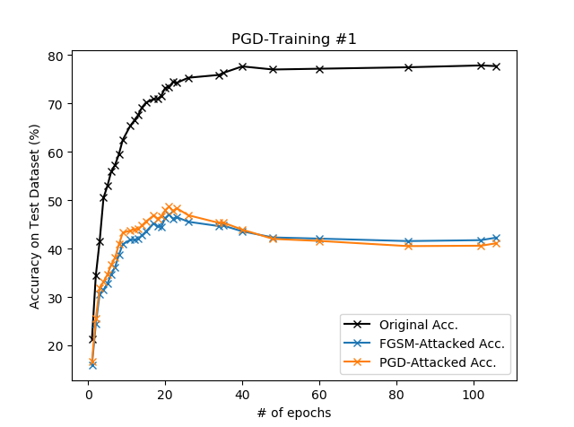
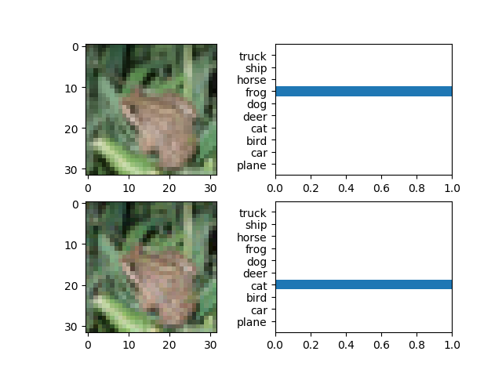

## Adversarial Training (CIFAR-10)

### Original Classifier

#### Training

```
python train.py --device cuda
                --epochs 100
                --batch_size 32
                --lr 0.01
                --lr_decay 10
                --pgd_train 0

* data augmentation: RandomHorizontalFlip, RandomCrop
```

```
./weights/vgg16_e086_90.62.pth
```

#### Evaluation

```
python eval.py --device cuda
               --weight ./weights/vgg16_e086_90.pth
               --attack [None, 'fgsm', 'pgd']
```

| epoch | Original Acc. | FGSM-Attacked Acc. | PGD-Attacked Acc. |
| :-:   |  -:           |  -:                |  -:               |
| [e086](https://drive.google.com/a/korea.ac.kr/file/d/1AB8ipF9e_t0Du7W79sZtQIOFK9Q9waiQ/view?usp=sharing) | 90.73 %       | 25.09 %            |  0.55 %           |
| -     | 70.89 it/s    | 27.23 it/s         | 4.48 it/s         |

### PGD-Trained Classifier

#### PGD-Training #1

<p align="center">
    
</p>

```
python train.py --device cuda
                --epochs 300
                --batch_size 32
                --lr 0.01
                --lr_decay 20
                --pgd_train 1

* data augmentation: RandomHorizontalFlip
```

| epoch | Original Acc. | FGSM-Attacked Acc. | PGD-Attacked Acc. |
| :-:   |  -:           |  -:                |  -:               |
| e022  | 74.39 %       | 46.18 %            | 47.76 %           |
| e040  | 77.62 %       | 43.55 %            | 43.91 %           |


## Appendix

### Demo 01. PGD Attack

```
python demo_pgd.py
```

<p align="center">
    
</p>
