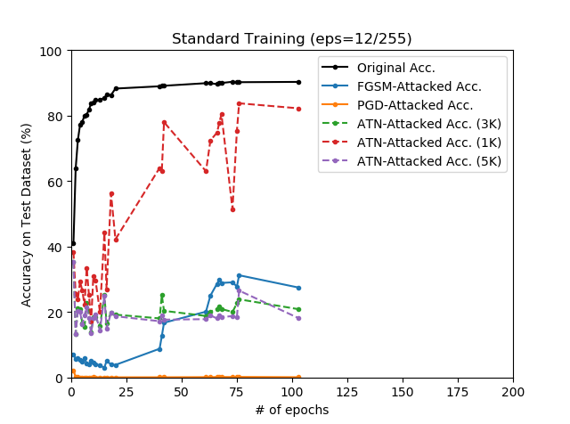
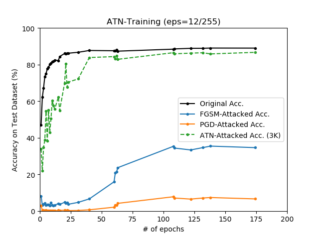

# Adversarial Training with ATN (CIFAR-10)

## Overview

#### Adversarial Transformation Network

Adversasrial examples can be generated via neural networks, and these special networks are called **Adversarial Transformation Network (ATN)**. It is presented in the following paper:

* **Adversarial Transformation Networks: Learning to Generate Adversarial Examples** <br>
  *Shumeeet Baluja, Ian Fischer* <br>
  https://arxiv.org/abs/1703.09387

The authors of the paper argue that ATN is useful for adversarial training:

> It appears that ATNs could be used in their adversarial training architecture, and could provide substantially more diversity to the trained model than current adversaries. This adversarial diversity improve model test-set generalization and adversarial robustness.

> Because ATNs are quick to train relative to the target network (in the case of IR2, hours instead of weeks), reliably produce diverse adversarial examples, (...) In this manner, throughout training, the target network would be exposed to a shifting set of diverse adversaries from ATNs that can be trained in a fully-automated manner.

This repository verifies that ATN can be useful for adversarial training. For comparison, PGD-based adversarial training is also implemented, which is referred to the following paper:

* **Towards Deep Learning Models Resistant to Adversarial Attacks** <br>
  *Aleksander Madry, Aleksandar Makelov, Ludwig Schmidt, Dimitris Tsipras, Adrian Vladu* <br>
  https://arxiv.org/abs/1706.06083

In addition, if you would like to know almost all about the adversarial example, see:

* **Adversarial Examples in Modern Machine Learning: A Review** <br>
  *Rey Reza Wiyatno, Anqi Xu, Ousmane Dia, Archy de Berker* <br>
  https://arxiv.org/abs/1911.05268


## Notes on ATN

#### Types of ATN

Intuitively, we can think of two main types of ATN.

* **Perturbation ATN (P-ATN)** <br>
  It is the type of ATN that generates small, but effective perturbations that acts as a filter on the image. The image combined with the generated perturbations acts as adversarial exmaple for the target classifier.

* **Adversarial Auto-Encoding ATN (AAE-ATN)** <br>
  AAE-ATNs are similar to standard autoencoders in that they attempt to accurately reconstruct the original image. However, there is a difference in that the reconstructed image acts as adversarial example for the target classifier.

Because P-ATN is convenient to place a limit on the size of the perturbation, we use P-ATN for our experiment.

#### Defining Loss for ATN

In general, we should consider two losses to train ATN. It is difficult to create an ATN that produces adversarial examples that satisfy Lx and Ly at the same time. Intuitively, reducing Lx increases Ly, and reducing Ly increases Lx, and it makes difficulty to define the entire loss function properly.

* **Lx: Perturbation Loss** <br>
  The adversarial example generated by ATN should not be distinguishable by the human eye. It is generally known that simply using L2 Loss is sufficient.

* **Ly: Adversarial Loss** <br>
  The adversarial example generated by ATN should cause target classifiers to malfunction. It should be properly defined according to the type of attack (e.g. non-targeted or targeted).

However, Our experiments use P-ATN with limited perturbation size, so we only need to consider Ly.

## Demo: Adversarial Attack

<p align="center">
    
</p>

```
python demo_pgd.py --device cpu
                   --pgd_type linf

python demo_atn.py --device cpu
```

The PGD on left side works by calculating the gradients for a given classification network (we assume a white-box in this situation), and it can almost always produce valid results for typical images without pre-requirements. However, in the case of ATN on right side, note that it is only possible to produce valid results after a proper learning has been achieved (this is not satisfactory in this demonstration, and the cat image is just a specially easy case).

## Result #1: Adversarial Training (eps=4/255)

### FGSM-Training

<p align="center">
    
</p>

### PGD-Training

<p align="center">
    
</p>

### ATN-Training

<p align="center">
    
</p>

## Result #2: Adversarial Training (eps=8/255)

### FGSM-Training

<p align="center">
    
</p>

### PGD-Training

<p align="center">
    
</p>

### ATN-Training

<p align="center">
    
</p>

## Result #3: Adversarial Training (eps=12/255)

### FGSM-Training

<p align="center">
    
</p>

### PGD-Training

<p align="center">
    
</p>

### ATN-Training

<p align="center">
    
</p>
