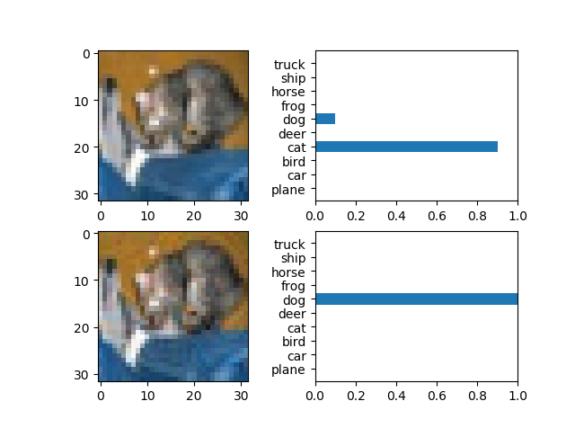
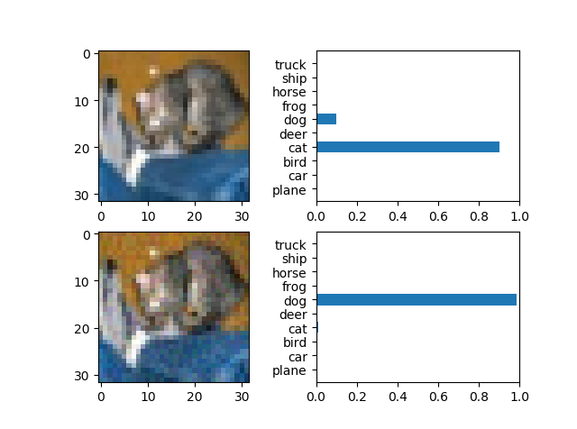
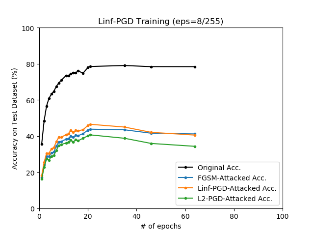
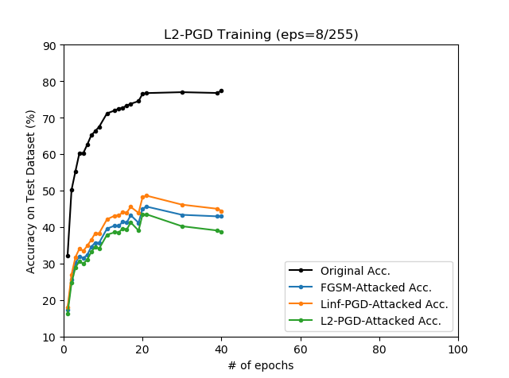

# Adversarial Training with ATN (CIFAR-10)

## Overview

Adversasrial examples can be generated via neural networks, and these special networks are called Adversarial Transformation Network. This repository verifies that ATN can be useful for adversarial training. The references are as follows:

* **Adversarial Transformation Networks: Learning to Generate Adversarial Examples** <br>
  *Shumeeet Baluja, Ian Fischer* <br>
  https://arxiv.org/abs/1703.09387

* **Towards Deep Learning Models Resistant to Adversarial Attacks** <br>
  *Aleksander Madry, Aleksandar Makelov, Ludwig Schmidt, Dimitris Tsipras, Adrian Vladu* <br>
  https://arxiv.org/abs/1706.06083

## Demo: Adversarial Attack

<p align="center">
    
</p>

```
python demo_pgd.py --device cpu
                   --pgd_type linf

python demo_atn.py --device cpu
```

The PGD on left side works by calculating the gradients for a given classification network (we assume a white-box in this situation), and it can almost always produce valid results for typical images without pre-requirements. However, in the case of ATN on right side, note that it is only possible to produce valid results after a proper learning has been achieved (this is not satisfactory in this demonstration, and the cat image is just a specially easy case).

## Result: Adversarial Training

### Standard Training

<p align="center">
    
</p>

### PGD-Training

#### Linf-PGD

<p align="center">
    
</p>

#### L2-PGD

<p align="center">
    
</p>

### ATN-Training
